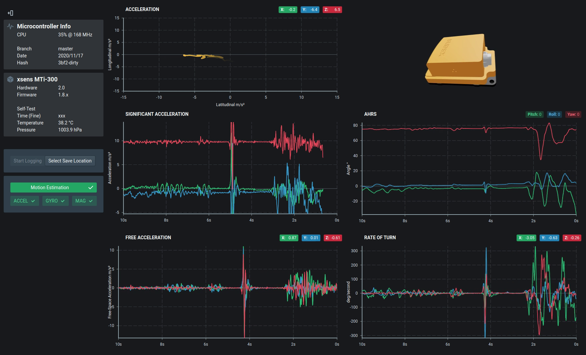

# STM32 with xsens MTi IMU

This is an example project which acts as a basic implementation of my [`xsens-mti`](https://github.com/Scottapotamas/xsens-mti) library, running on a STM32F4 Discovery board.

This project also integrates [electricui-embedded](https://github.com/electricui/electricui-embedded) for real-time charting of variables from the STM32.

# IMU Configuration

The IMU used is a [xsens MTi-300-2A5G4](https://shop.xsens.com/shop/mti-100-series/mti-300-ahrs/mti-300-ahrs-2a8g4) (4th generation, RS232+USB, 450deg/sec), along with a [CA-MP2-MTi cable](https://shop.xsens.com/shop/mti-10-series/accessories/mti-10-series-accessories/ca-mp2-mti). The IMU requires a 5-34V supply, drawing around 600mW.

The IMU can be configured with the MT manager tool, I configure them to output quaternions, acceleration, free acceleration, rate of turn, temperature, pressure, statusword and coarse timing, at 400Hz.

At some point in the future, I might perform configuration of the IMU from the STM32.

# STM32 Setup

This project is intended for use with the ever-popular green [STM32F407 Discovery Board](https://www.st.com/en/evaluation-tools/stm32f4discovery.html).

A USB-UART adapter is needed to connect the STM32 to the PC for realtime display of data connected to USART2 with PD5/PD6.

The IMU's RS232 connection is connected to a MAX232 transceiver IC, ultimately interfacing to the STM32's USART1 with PB6/PB7.

Ground is common between the USB-UART, STM32 and xsens hardware.

## Firmware Setup

This repo does not contain the [`xsens-mti`](https://github.com/Scottapotamas/xsens-mti) or [electricui-embedded](https://github.com/electricui/electricui-embedded) libraries.

Download/clone them into `/firmware/vendor/xsens-mti` and `/firmware/vendor/electricui` respectively before use.

The firmware assumes an IMU baudrate of `921600` and an Electric UI baud rate of `500000`. These can be changed in [`app_times.h`](firmware/src/app_state_machines/app_times.h).

## Usage Notes

The actual firmware is pretty simple, but is built on an underlying bespoke co-operative hierarchical state-machine/tasking system which might appear intimidating at first glance.

As a quick explanation, the main loop runs at 1kHz. Each tick, a task is run along with background tasks and then the CPU is put into `WFI` light sleep until interrupts need servicing, or the next tick has arrived.

[app_task_communication.c](/firmware/src/app_state_machines/app_task_communication.c) is responsible for setting up the UART hal (DMA driven RX/TX) for both the `xsens-mti` libary and `electricui-embedded`. It also sets up handlers and serial output callback functions.

Every tick, the inbound serial FIFO buffers are polled for data, and bytes are passed to the relevant libraries.

Inbound motion related packets are received from the IMU, parsed, then a callback is fired providing valid motion data (`AppTaskCommunication_imu_callback_event()`). This data is passed over to a setter/getter 'config' helper in [`configuration.c`](/firmware/src/drivers/configuration.c) which is essentially data storage and abstraction on the UI communications library.

In more involved applications, this data would instead be passed to control systems, or events generated to allow other systems to handle IMU data.

# Interface

## Setup

The UI works on Windows, Mac OS, and Linux.

With [`arc`](https://electricui.com/install) installed, navigate a shell to `/interface` and run `arc install` to get everything setup.

## Usage

From `/interface`, run `arc start` from a shell to launch the development environment.

To build an executable bundle (production build), run `arc build`. The output will be put in `/interface/release/...`.

The main points of interest are inside [the DevicePages folder](interface/src/application/pages/DevicePages).

